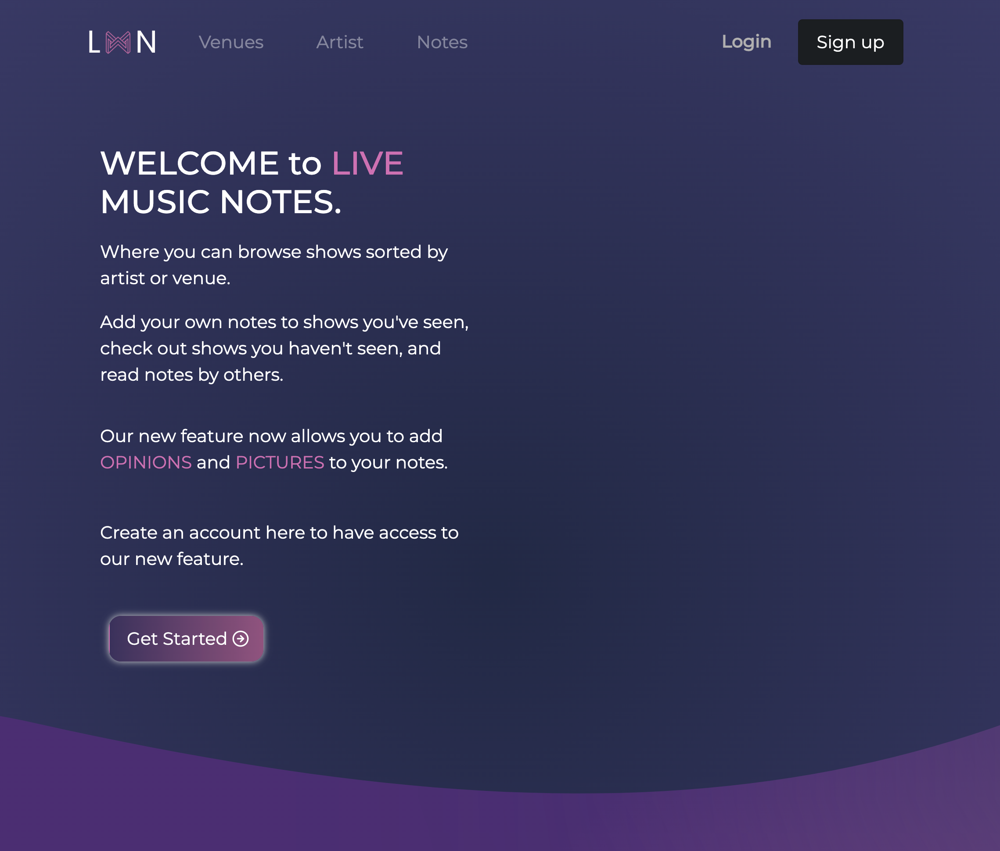
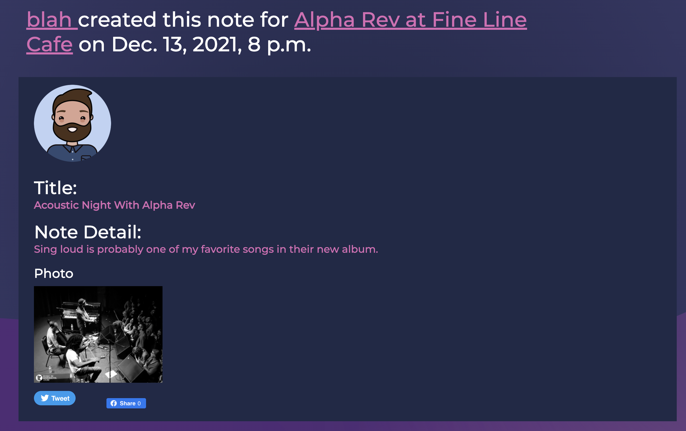

#### Live Music Notes, Opinions, Photographs

---

## General Information

An application that allows users to browse shows sorted by artist or venue.

Users add notes to shows they have seen, check out shows they haven't seen, and read notes by others.

## Live Site

https://lmn-ejjns.uc.r.appspot.com/

## Installation

To Install project packages

Create and activate a virtual environment. Use Python3 as the interpreter. Suggest locating the venv/ directory outside of the code directory.

```
pip install -r requirements.txt
python manage.py makemigrations
python manage.py migrate
python manage.py runserver
```

## Run Locally

Clone the project

```bash
  git clone https://github.com/mctc-itec/lmn-ejjns.git
```

Go to the project directory

```bash
  cd my-project
```

**Create and activate a virtual environment. Use Python3 as the interpreter. Suggest locating the venv/ directory outside of the code directory.**

Install dependencies

```bash
  pip install -r requirements.txt

```

Use SQLite database locally.

```bash
  python manage.py makemigrations
  python manage.py migrate
```

Start the server

```bash
  run python manage.py runserver
```

## Technologies Used

- Web Framework - Django
- Language - Python3
- Styling - Bootstrap
- Database - SQLite(local) PaaS(deployment)
- Selenium(testing)
- Google Cloud for Deployment

## Features

- App displays a list of music venues, and a list of artists.
- Users can browse list of artists who have played at each venue; and the venues at which a particular artists has played.
- Users can create a profile and edit their own profile.
- Users can add notes, dates, and photos to their notes.
- Users can browse through other users notes.
- Users can share their note on Twiiter and or on facebook.

## Screenshots




## Linting

Ensure requirements are installed, then run,

```
flake8 .
```

Configure linting rules if desired in the .flake8 file.

### Run tests

```
python manage.py test
```

Or just some of the tests,

```
python manage.py test lmn.tests.test_views
python manage.py test lmn.tests.test_views.TestUserAuthentication
python manage.py test lmn.tests.test_views.TestUserAuthentication.test_user_registration_logs_user_in
```

### Functional Tests with Selenium

Make sure you have the latest version of Chrome or Firefox, and the most recent chromedriver or geckodriver, and latest Selenium.

chromedriver/geckodriver needs to be in path or you need to tell Selenium where it is. Pick an approach: http://stackoverflow.com/questions/40208051/selenium-using-python-geckodriver-executable-needs-to-be-in-path

If your DB is hosted at Elephant, your tests might time out, and you might need to use longer waits http://selenium-python.readthedocs.io/waits.html

Run tests with

```
python manage.py test lmn.tests.functional_tests.functional_tests
```

Or select tests, for example,

```
python manage.py test lmn.functional_tests.functional_tests.HomePageTest
python manage.py test lmn.functional_tests.functional_tests.BrowseArtists.test_searching_artists
```

### Test coverage

From directory with manage.py in it,

```
coverage run --source='.' manage.py test lmn.tests
coverage report
```
